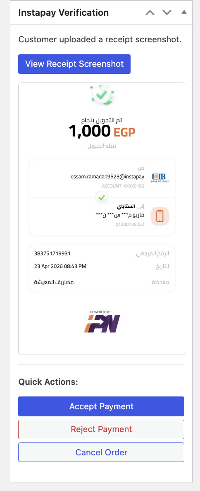
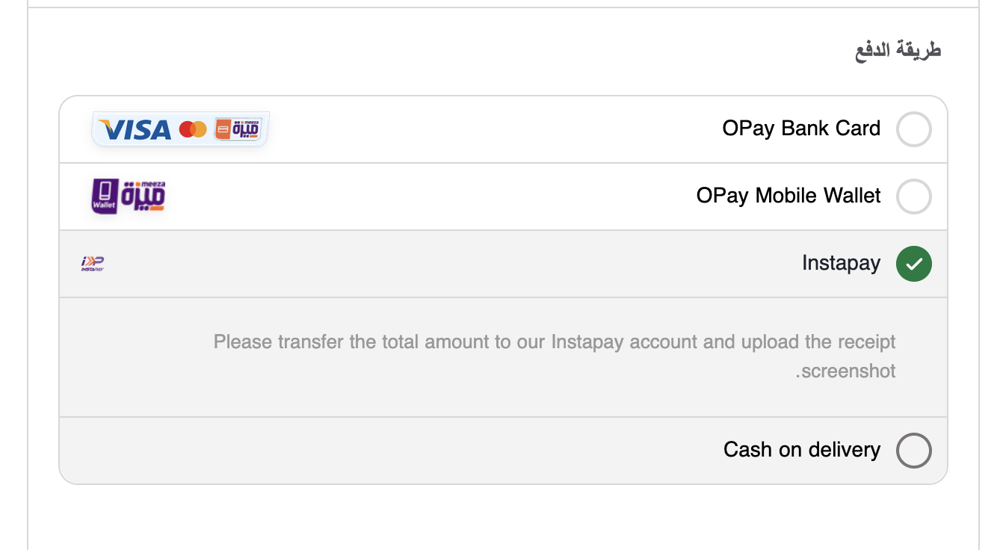
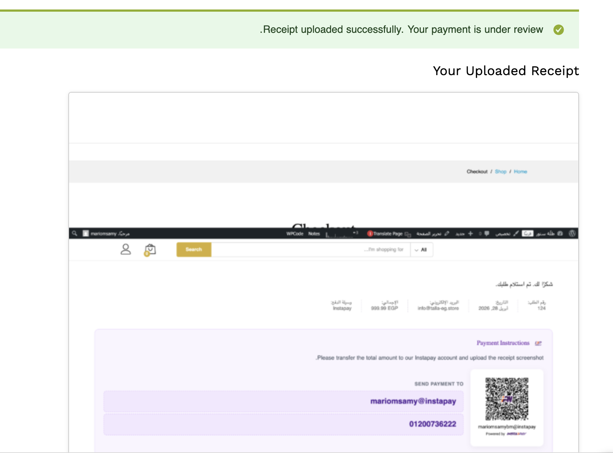
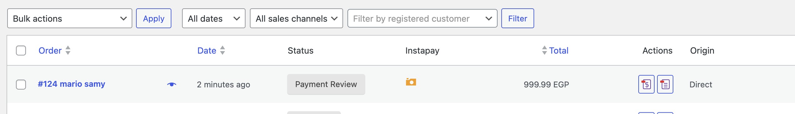
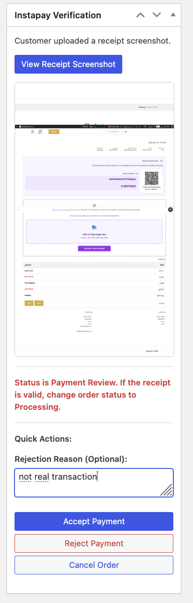
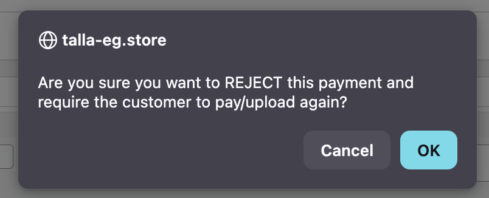
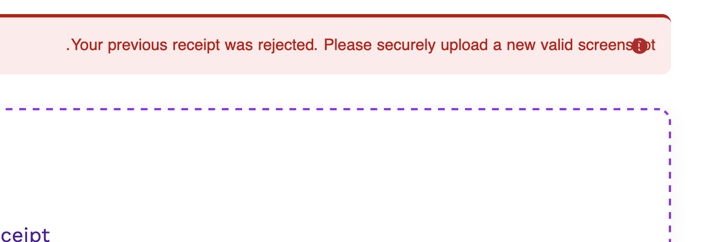
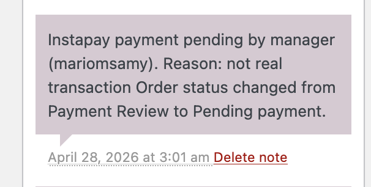

# Instapay Gateway for Egypt

A manual Instapay payment gateway for WooCommerce stores that accept Egyptian pounds. Customers receive payment instructions, upload a receipt, and store managers approve or reject it from the order screen.

[Download the latest release](https://github.com/mariomsamy/instapay-woo/releases/latest) | [Release notes](RELEASE-NOTES.md) | [WordPress readme](readme.txt)

## Features

- Instapay address, phone number, QR code, and optional mobile payment link.
- Secure JPG, PNG, and WebP receipt uploads up to 5MB.
- Payment Review order status with approve, reject, cancel, and rejection-reason actions.
- Protected receipt viewing, randomized filenames, image metadata removal, and optional resizing.
- HPOS-compatible WooCommerce order storage.
- Dashboard review queue, order-list receipt indicator, audit notes, and manager email notifications.
- Automatic cleanup for receipts on old failed, cancelled, or refunded orders.
- Optional REST uploads, disabled by default.
- Arabic and English translation catalogs.

## Requirements

| Component | Minimum |
| --- | --- |
| WordPress | 6.3 |
| WooCommerce | 8.5 |
| PHP | 7.4 |
| Currency | EGP |

## Installation

1. Download the plugin ZIP from the [latest release](https://github.com/mariomsamy/instapay-woo/releases/latest).
2. In WordPress, open **Plugins > Add New > Upload Plugin**.
3. Upload the ZIP, install it, and activate it.
4. Open **WooCommerce > Settings > Payments > Instapay (Egypt)**.
5. Configure the payment address, phone number, QR code, and optional settings.

The gateway is shown only when the store currency is EGP.

## Receipt Security

Receipt access requires an authorized manager, the owning customer account, or a matching order key, together with a valid nonce. Uploaded files are validated by image content and must remain inside the dedicated receipt directory.

The plugin writes deny rules for Apache and IIS. Nginx administrators should also block direct public access to `/wp-content/uploads/instapay_receipts/`; receipts should be served only through the plugin's protected viewer.

## REST Uploads

Enable REST uploads only when needed under the gateway settings. Send a multipart `POST` request to:

```text
/wp-json/instapay-gateway-for-egypt/v1/receipt
```

Required fields: `order_id`, `order_key`, and the `instapay_receipt` file. The same file, order-state, and ownership checks used by browser uploads apply.

## Screenshots

<details>
<summary>View plugin screenshots</summary>











</details>

## العربية

إضافة دفع يدوي عبر إنستاباي لمتاجر WooCommerce التي تستخدم الجنيه المصري. تعرض الإضافة بيانات الدفع للعميل، وتسمح له برفع صورة الإيصال، ثم تتيح لمدير المتجر مراجعة الإيصال وقبوله أو رفضه من صفحة الطلب.

**التثبيت:** حمّل ملف الإضافة من [أحدث إصدار](https://github.com/mariomsamy/instapay-woo/releases/latest)، ثم ارفعه من **إضافات > أضف جديد > رفع إضافة**. بعد التفعيل، انتقل إلى **WooCommerce > الإعدادات > المدفوعات > Instapay (Egypt)** لإدخال عنوان إنستاباي ورقم الهاتف ورابط رمز QR والإعدادات الاختيارية.

يتم تعطيل رفع الإيصالات عبر REST API افتراضياً. يجب على مستخدمي Nginx منع الوصول المباشر إلى مجلد `/wp-content/uploads/instapay_receipts/` من إعدادات الخادم.

## Credits

Developed and copyrighted by [Recipe Codes](https://recipe.codes) / Mario M. Samy.

Security hardening in version 1.2.0 includes work contributed by [Abdelrahman Elawadi](https://github.com/abdelrahman-elawadi). Recipe Codes and Mario M. Samy remain the plugin author and copyright owner.

## License

GPL-2.0-or-later. See [GNU GPL 2.0](https://www.gnu.org/licenses/gpl-2.0.html).
